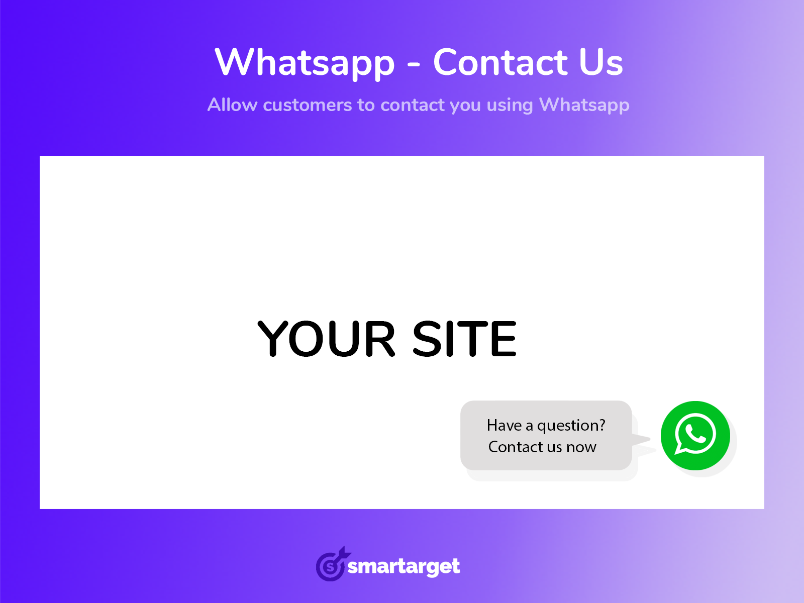

<h1 align="center">Smartarget Whatsapp - Contact Us</h1>

Allow customers to contact you using Whatsapp

Let's make it easier for your customers to contact you! Probably most of your users are using Whatsapp, so its time to give them the option to contact you by using Whatsapp.

With 'Whatsapp - Contact Us' you can add a small icon on the bottom-right corner with you phone number and short message as "Contact us" or "message us" etc. When user click on the icon - new tab will be pop with Whatsapp for web and chat window with you.

This plugin adds Whatsapp button on your sylius website. You can configure whatsapp buttons per sale channel.

 

## Installation

**Beware!**

> This installation instruction assumes that you're using Symfony Flex.

1. Require the plugin using composer

    ```bash
    composer require smartarget/sylius-smartarget-whatsapp-contact-us-plugin --no-scripts
    ```

2. Add to config/bundles.php
    ```
    Smartarget\SyliusSmartargetWhatsappContactUsPlugin\SmartargetSyliusSmartargetWhatsappContactUsPlugin::class => ['all' => true]
    ```

3. Create config/packages/smartarget_sylius_smartarget_whatsapp_contact_us_plugin.yaml file with content

    ```yaml
    imports:
        - { resource: "@SmartargetSyliusSmartargetWhatsappContactUsPlugin/Resources/config/config.yaml" }
    ```

4. Create config/routes/smartarget_sylius_smartarget_whatsapp_contact_us_plugin.yaml file with content

    ```yaml
   smartarget_sylius_smartarget_whatsapp_contact_us_admin:
       resource: "@SmartargetSyliusSmartargetWhatsappContactUsPlugin/Resources/config/routing/admin.yaml"
       prefix: /admin
    ```
 
5. Generate & Run Doctrine migrations

    ```
    ./bin/console doctrine:migration:diff
    ./bin/console doctrine:migration:migrate
    ```

6. Clear cache

    ```bash
    bin/console cache:clear
    ```

## How it works

Go to Whatsapp - Contact Us section in your admin panel and add new Whatsapp button(s)! Don't forget to enable new Whatsapp button and toggle specific sales chanel.

## Examples

You could use this plugin to:

- Turn visitors into leads.
- Doing customers support.

Use Smartarget Integration to change button position and popup message.

## Support

For any questions visit https://smartarget.online/page_contact.html
